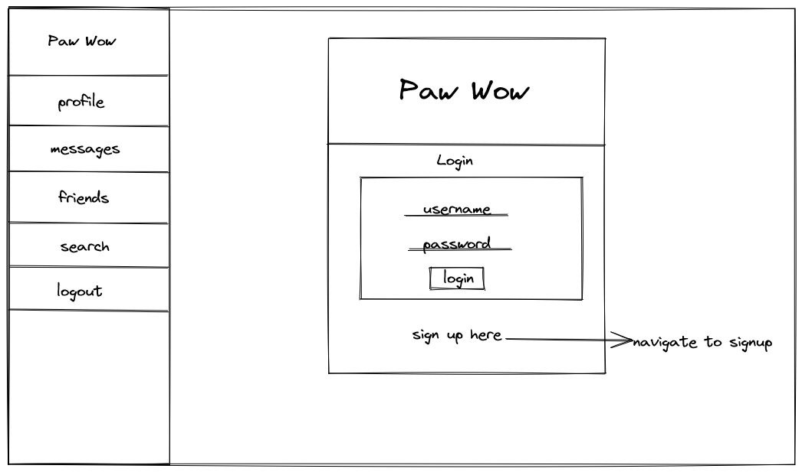
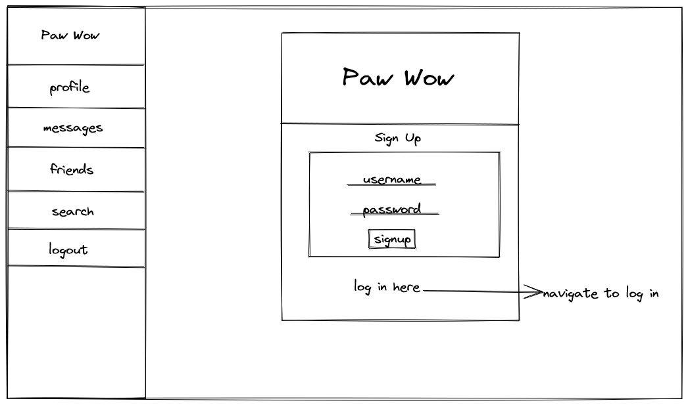
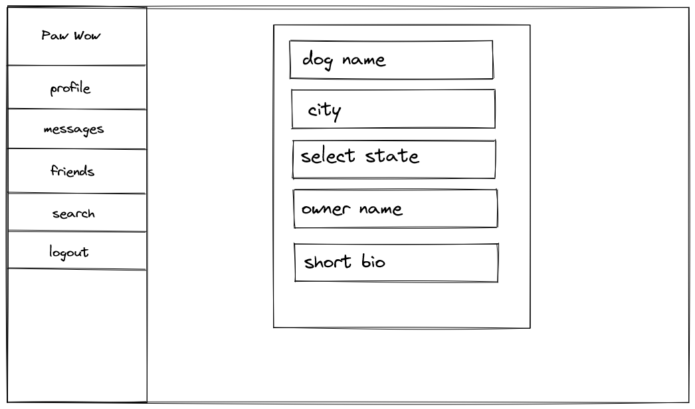
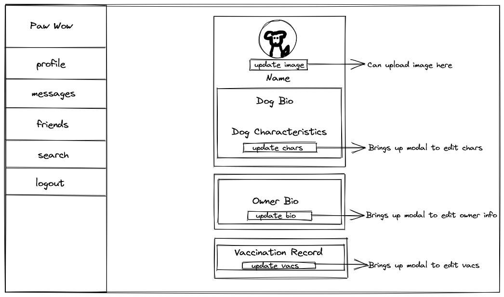
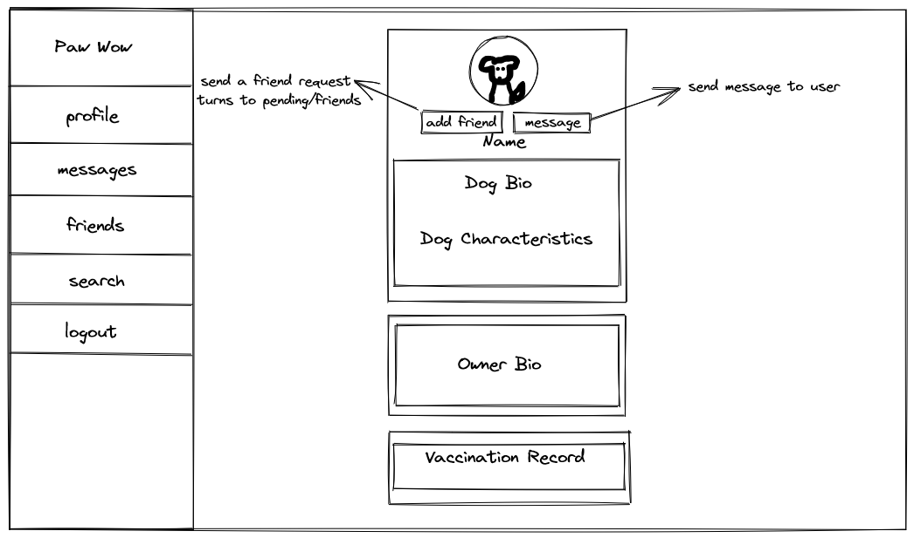
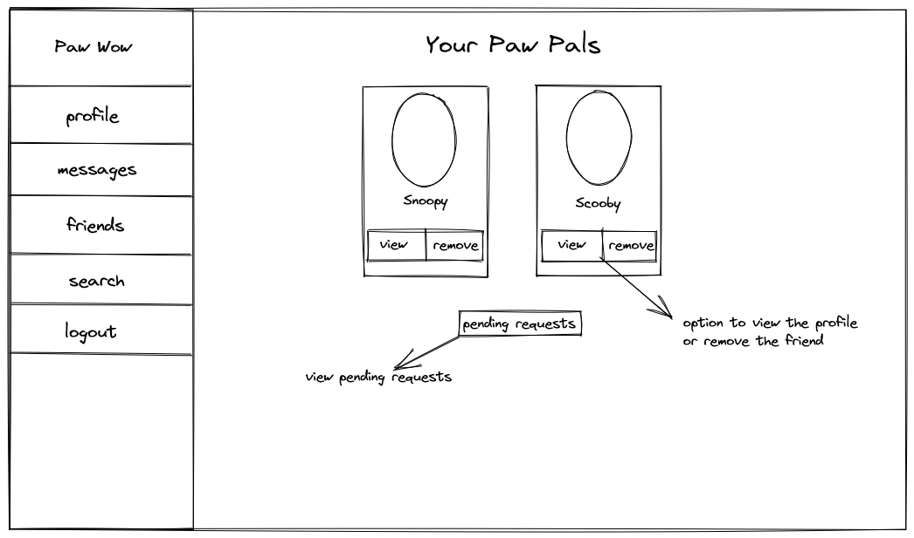
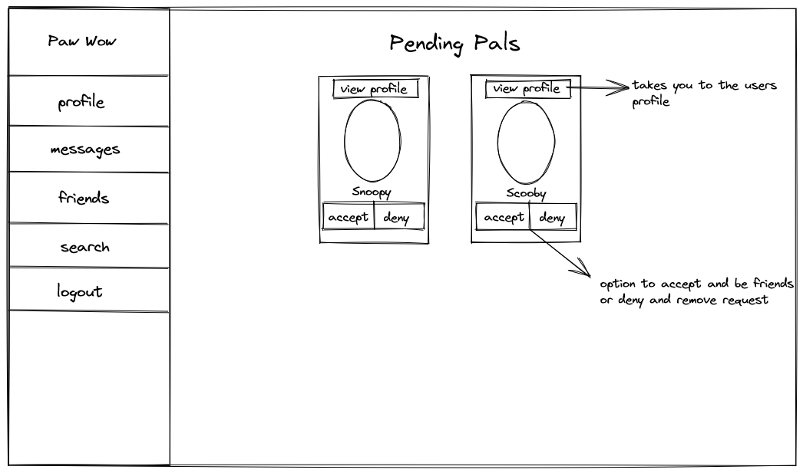
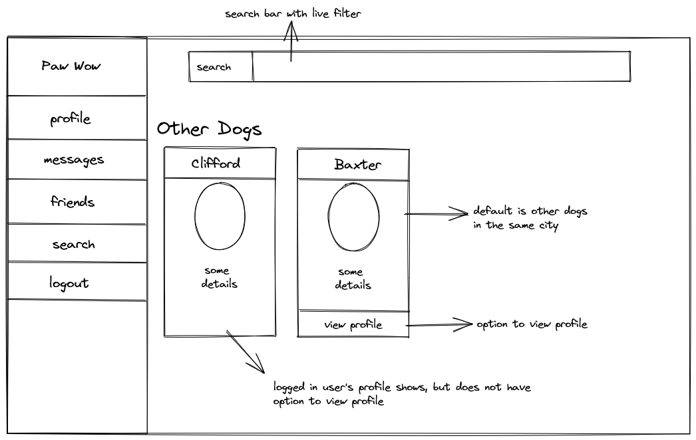

# Graphical Human Interface

## Login Page

This is the landing page, where a user can log in. Or if they do not have an account, they can navigate to the sign up page from here.

## Sign Up Page
If a user needs to sign up, this is where they will input a username and password. Then it brings up another form to input basic info for their starter profile.

## Profile Page

Once a user has either logged in or completed the sign up form, they will be brought to their own profile page. Here, they can update their photo or information on their profile.

Once a user is logged in, they can use the navigation bar fully to access their friends, messages, and search features.

## Other Profile Page

When a user goes to another profile page, they will see all the details of the user. They will also have the ability to send a friend request (or see if a request is pending or if they are friends) or a message.

## Friends List Page

A logged in user can view their friends list and see any friends they have and be able to navigate to their page or remove them as a friend. This is also where a user can navigate to their pending requests.

## Pending Requests Page

A logged in user can see their pending requests here. They will be able to view the profile, accept, or deny the request.

## Search Page

A logged in user can use the search page to find any nearby dogs who are in the same city. Or they can search through to find another dog.

